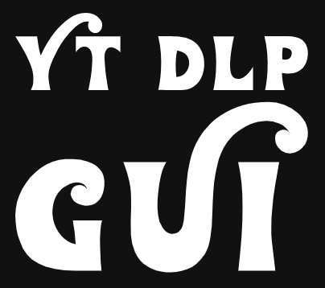
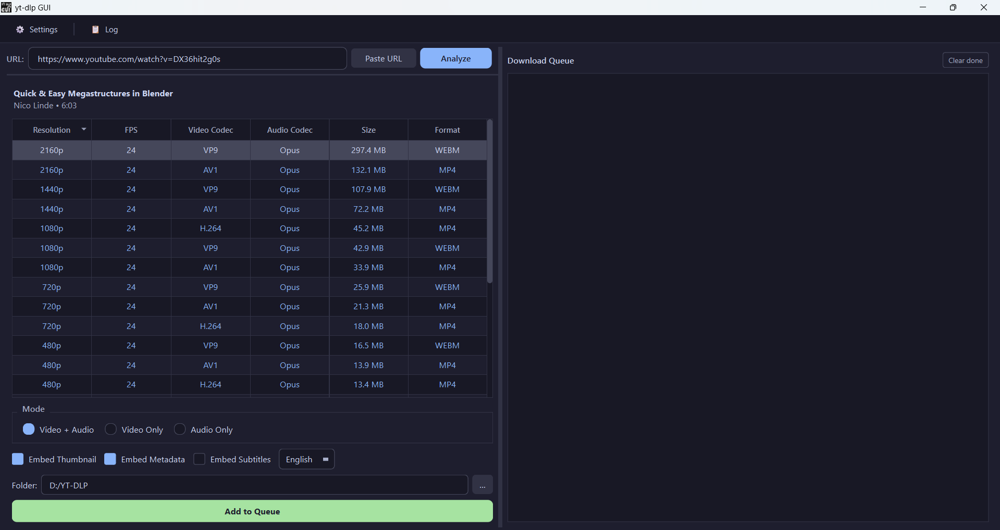

# yt-dlp GUI

**A clean, fast desktop app for downloading videos, playlists, and audio — no command line needed.**

---

## Overview

**yt-dlp GUI** is a desktop app that lets you download videos and playlists by pasting a link — pick a quality, choose a folder, and download. No flags, no terminal, no technical setup.

It supports single videos, full playlists, audio-only extraction, subtitle embedding, and multiple simultaneous downloads, all in a clean, themeable interface with a download queue that remembers your downloads even after you close the app.

## Features

- 🔗 **Paste & analyze** — drop a URL and instantly see every available quality
- 🎚️ **Format table** — sortable table of resolutions, quality, and file sizes, with separate modes for Video+Audio / Video Only / Audio Only
- 📋 **Playlist support** — pick exactly which videos to download from a playlist, with search and select-all
- 🎵 **Audio extraction** — convert to MP3, M4A, FLAC, Opus, WAV, or OGG
- 📥 **Download queue** — download several videos at once, with automatic retry and no overwriting of existing files
- 🖼️ **Extras on download** — embed thumbnails, subtitles (any language, including auto-generated), and video info directly into the file
- 🍪 **Works with private/age-restricted videos** — pull cookies from your browser (Chrome, Firefox, Edge, Safari, and more) for content that needs you to be logged in
- 🌗 **Dark & light themes**
- 🚦 **Speed limit** — cap download speed so it doesn't hog your connection
- 📜 **Log panel** — see exactly what's happening if a download fails

## Screenshots

## Installation

1. Go to the [Releases](../../releases) page.
2. Download the latest `ytdlp-gui.exe`.
3. Run it — no installation or extra setup required. Everything needed (including FFmpeg) is bundled inside.

> Windows may show a SmartScreen warning for unrecognized publishers on first run. Click **More info → Run anyway** to proceed.

## Usage

1. Paste a video or playlist URL into the URL bar and click **Analyze**.
2. If it's a playlist, choose which videos to include in the dialog that appears.
3. Pick **Video + Audio**, **Video Only**, or **Audio Only** mode, then select a quality from the table.
4. Optionally turn on subtitle/thumbnail/metadata embedding, choose an audio conversion format, and set the output folder.
5. Click **Add to Queue** — the download starts automatically.
6. Track progress in the queue on the right; open the **Log** panel from the toolbar if a download needs troubleshooting.

## Settings

Open Settings (⚙ button in the toolbar) to configure:

| Tab | Options |
|---|---|
| **General** | Filename template, theme (dark/light), how many downloads run at once |
| **Network** | Download speed limit, which browser to pull login cookies from |
| **FFmpeg** | Custom FFmpeg path, if you don't want to use the bundled one |

Your settings and download queue are saved automatically, so closing the app won't lose them.

## License

Licensed under the **GNU General Public License v3.0** — see [LICENSE](LICENSE) for details.
